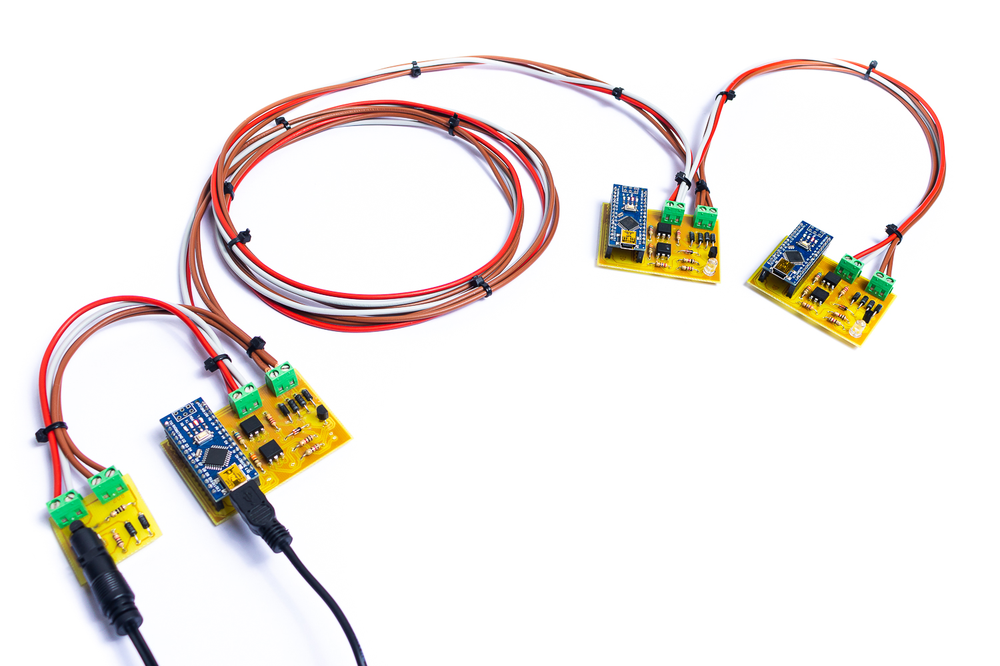
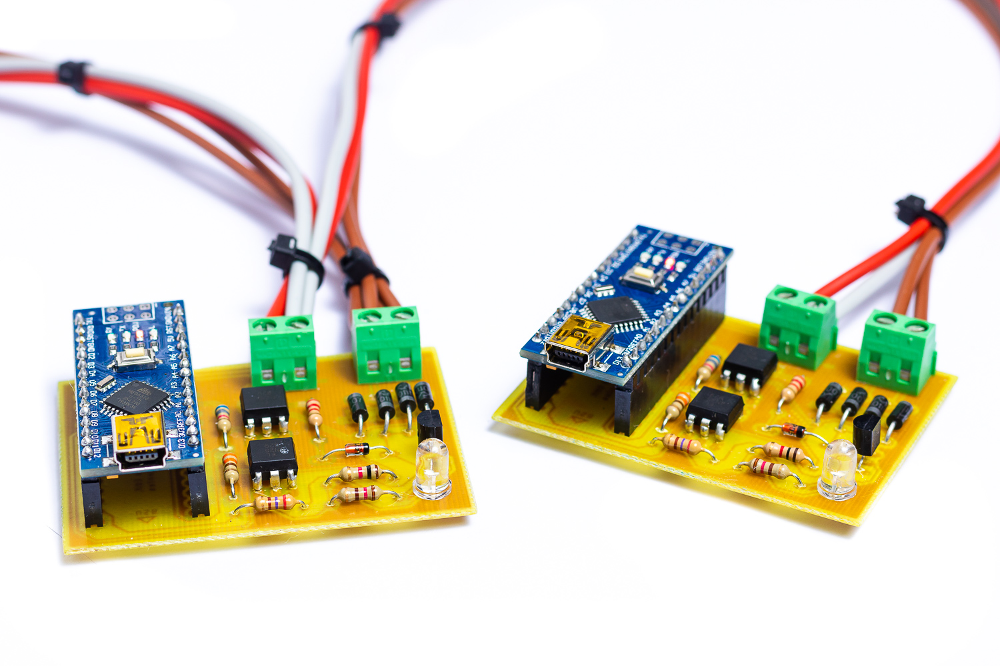
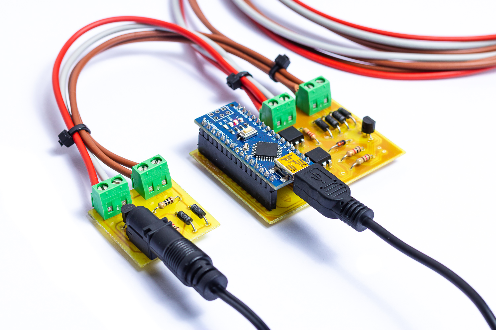

# DALI adapter for Arduino Nano
This project was made for the subject "Automatización de Edificios Inteligentes" in the Industrial Engineering Master Degree (University of Seville)

Author:
- Diego J. Benjumea

This is a physical implementation of the DALI protocol for a home automation installation, and some of its commands using Arduino Nano boards and simple electronics.

## Physical implementation
The bus has been build as follow

